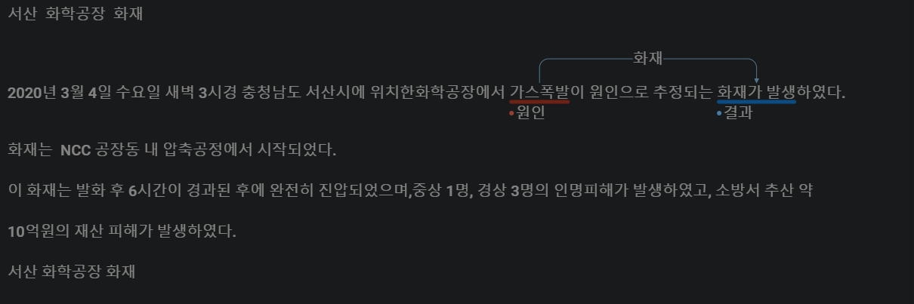
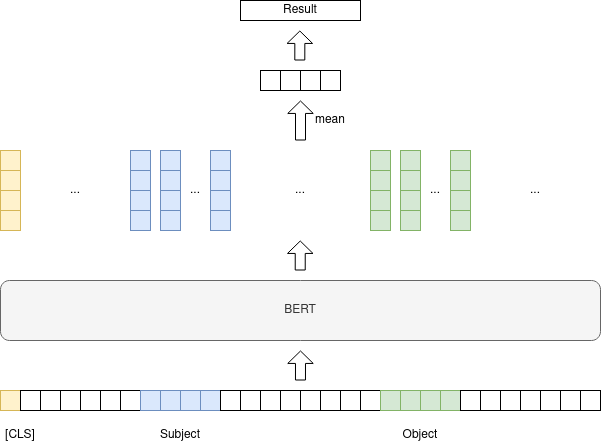

# Casuality

## 1. Causal Relation Extraction(인과관계 추출)

어떠한 문장에서 인과관계가 존재하는지, 인과관계가 존재한다면 원인과 결과의 분석한다.</br>
문장 속에서 단어간에 관계성을 파악하는 것은 의미나 의도를 해석함에 있어서 많은 도움을 줍니다.(KLUE)

- 예시
    ```
    sentence    : 충주 화학공장 화재 2019년 8월 30일 금요일 23시 47분경 충청북도 충주시에 위치 한 접착제 원료 등 생산공장에서 <e1>전기적 요인</e1>에 의한 발화로 추정 되는 <e2>화재가 발생</e2>하였다.
    relation    : 화재	
    subject(e1) : 전기적 요인	
    object(e2)  : 화재가 발생	
    ```


## 2. 전처리

  1. [doccano](https://github.com/doccano/doccano)를 활용하여 레이블링
  

  2. 레이블링 데이터 추출  
    doccano에서 레이블링 작업을 한 데이터는 jsonl 파일로 추출된다.

```json
    export_data.jsonl

    {
    "id": 303,
    "text": "서산 화학공장 화재 2020년 3월 4일 수요일 새벽 3시경 충청남도 서산시에 위치한 화학공장에서 가스폭발이 원인으로 추정되는 화재가 발생하였다. 화재는 NCC 공장동 내 압축공정에서 시작되었다. 이 화재는 발화 후 6시간이 경과된 후에 완전히 진압되었으며, 중상 1명, 경상 3명의 인명피해가 발생하였고, ...... ",
    "relations": [{
            "id": 51,
            "from_id": 186,
            "to_id": 187,
            "type": "화재"
        }
    ],
    "entities": [{
            "id": 186,
            "start_offset": 55,
            "end_offset": 59,
            "label": "원인"
        }, {
            "id": 187,
            "start_offset": 71,
            "end_offset": 77,
            "label": "결과"
        }
    ]
    }
```

  3. 추출된 jsonl을 tsv 파일로 변환</br>
      파일을 이용하여 entities의 start_offset, end_offset을 활용하여 스폐셜토큰이 추가된 sentence를 만든다.

      ```
      .
      .
      .
      화재	가스폭발	화재가 발생	서산 화학공장 화재 2020년 3월 4일 수요일 새벽 3시경 충청남도 서산시에 위치한 화학공장에서 <e1>가스폭발</e1>이 원인으로 추정되는 <e2>화재가 발생</e2>하였다.
      .
      .
      .
      ```

  4. 학습을 위한 토큰화된 json파일 생성
    
```json
 {
    "input_ids": [2, 789, 4348, 15, 2688, 4348, 14768, 14518, 321, 4203, 4316, 1476, 60, 2170, 4085, 4147, 62, 2255, 14518, 92, 1485, 4075, 94, 17, 3, 0, 0, 0, 0, 0, 0, 0, 0, 0, 0, 0, 0, 0, 0, 0, 0, 0, 0, 0, 0, 0, 0, 0, 0, 0, 0, 0, 0, 0, 0, 0, 0, 0, 0, 0, 0, 0, 0, 0, 0, 0, 0, 0, 0, 0, 0, 0, ...,
    "token_type_ids": [0, 0, 0, 0, 0, 0, 0, 0, 0, 0, 0, 0, 0, 0, 0, 0, 0, 0, 0, 0, 0, 0, 0, 0, 0, 0, 0, 0, 0, 0, 0, 0, 0, 0, 0, 0, 0, 0, 0, 0, 0, 0, 0, 0, 0, 0, 0, 0, 0,...],
    "attention_mask": [1, 1, 1, 1, 1, 1, 1, 1, 1, 1, 1, 1, 1, 1, 1, 1, 1, 1, 1, 1, 1, 1, 1, 1, 1, 0, 0, 0, 0, 0, 0, 0, 0, 0, 0, 0, 0, 0, 0, 0, 0, 0, 0, 0, 0, 0, 0, 0, 0, 0, 0, 0, 0, 0, 0, 0, 0, 0...],
    "label": 0,
    "sub_start_pos": 13,
    "sub_end_pos": 16,
    "obj_start_pos": 20,
    "obj_end_pos": 22
}
```

# 3. 학습


 


